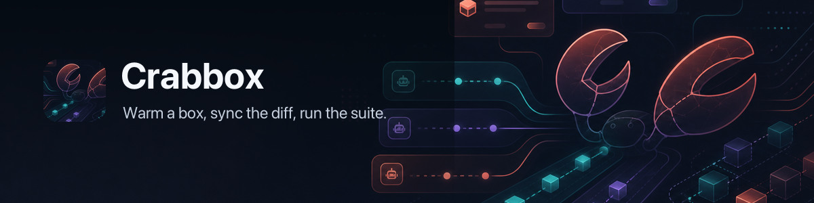

# 🦀 📦 Crabbox



[](https://github.com/openclaw/crabbox/actions/workflows/ci.yml)
[](https://github.com/openclaw/crabbox/actions/workflows/release.yml)
[](https://github.com/openclaw/crabbox/releases/latest)

**Warm a box, sync the diff, run the suite.**

Crabbox is a remote software testing and execution control plane for maintainers
and AI agents. Lease fast managed cloud capacity, point at an existing SSH host,
or use an agent sandbox provider — then sync your dirty checkout, run commands
remotely, stream output, collect evidence, and release. Local edit-save-run
loop, cloud-grade compute, agent-ready observability.

```sh
crabbox run -- pnpm test
```

Behind that one command: a Go CLI on your laptop, an optional coordinator that
owns provider credentials and lease state, and a managed or delegated runner.
Run the coordinator on Cloudflare Workers with a Durable Object, or as a
Node.js service backed by PostgreSQL.

## Trust model

Crabbox is a developer execution tool, not a hostile multi-tenant platform or a
uniform security sandbox. It assumes the local OS user, repository
configuration, configured project tooling, and authenticated coordinator
operators are trusted. Repository configuration is executable project
automation: it can run local helpers, select runtimes, mount host resources,
and control development infrastructure. Review unfamiliar repositories before
running Crabbox.

The optional coordinator is intended for a cooperative trusted team. Its
authentication, ownership, and sharing controls prevent unauthorized access
and accidental cross-owner operations, but do not provide isolation between
mutually adversarial tenants. See the [Security Policy](SECURITY.md) for the
supported boundary and [Operational security](docs/security.md) for deployment
guidance.

## How it works

```text
your laptop                 coordinator runtime              cloud provider
-------------               -------------------              --------------
crabbox CLI    -- HTTPS --> Cloudflare + Durable Object  --> Hetzner / AWS / Azure / GCP
   |                      or Node.js + PostgreSQL              |
   |                                                           |
   +------------- SSH + rsync to leased runner <---------------+
```

- **CLI** — Go binary. Loads config, mints a per-lease SSH key, asks the broker
  for a lease, waits for SSH, seeds remote Git, rsyncs the dirty checkout (with
  a fingerprint skip when nothing changed), runs the command, streams output,
  releases.
- **Coordinator** — the same fleet control plane on either Cloudflare Workers
  plus a Fleet Durable Object, or Node.js plus PostgreSQL and pg-boss. Owns
  provider credentials, serializes lease state, enforces active-lease and
  monthly spend caps, and expires stale leases. Auth is GitHub browser login, a
  shared bearer token, or an explicitly trusted identity proxy.
- **Runner** — a throwaway machine reachable over SSH on the primary port
  (default `2222`) plus configured fallback ports, prepared with Crabbox's
  sync/run prerequisites. Linux uses Ubuntu with cloud-init and `/work/crabbox`;
  native Windows uses OpenSSH, Git for Windows, and `C:\crabbox`. No broker
  credentials live on the box. Project runtimes (Go, Node, Docker, services,
  secrets) come from your repo's GitHub Actions hydration, devcontainer, Nix,
  mise/asdf, or setup scripts — not from Crabbox.

The data plane — SSH, rsync, command execution — always runs directly from the
CLI to the runner. The coordinator only manages leases, cost, and observability.

Only `aws`, `azure`, `gcp`, and `hetzner` can transfer provider lifecycle to the
coordinator, and even those run direct from the CLI when no coordinator URL is
configured. Every other provider runs direct or delegated. A direct-provider mode
(`--provider hetzner|aws|azure|gcp|digitalocean|linode|proxmox` with local
credentials) exists for debugging the coordinator itself or using private
infrastructure.

### Coordinator deployment choices

| Path                     | State and scheduling                                          | Best fit                                                                                                                     |
| ------------------------ | ------------------------------------------------------------- | ---------------------------------------------------------------------------------------------------------------------------- |
| **Cloudflare Workers**   | Fleet Durable Object, alarms, scheduled Worker trigger        | Managed edge deployment with minimal server operations and optional Cloudflare Access.                                       |
| **Node.js + PostgreSQL** | PostgreSQL key/value state, pg-boss alarms and reconciliation | Initial runtime for containers, a VM, or Kubernetes with one replica; requires Node.js, PostgreSQL 13+, TLS, and WebSockets. |
| **No coordinator**       | Local claims and provider-owned state                         | Personal/direct providers where shared credentials, history, budgets, and central cleanup are unnecessary.                   |

Both coordinator runtimes expose the same API, GitHub login, portal, provider
adapters, cost controls, cleanup behavior, and live bridges. State is not
automatically migrated between Durable Object storage and PostgreSQL.
Cloudflare is the established deployment; validate the newly shipped Node
runtime against the production proof checklist before cutover. See
[Infrastructure](docs/infrastructure.md) for deployment and ingress details.

For the full mental model, see [How Crabbox Works](docs/how-it-works.md). For
the doc-to-code map, see [Source Map](docs/source-map.md).

## Install

```sh
brew install openclaw/tap/crabbox
crabbox --version
```

No Homebrew? Grab a [GoReleaser archive](https://github.com/openclaw/crabbox/releases)
for macOS, Linux, or Windows.

Apple Silicon Homebrew bottles and archives also include the native
`crabbox-apple-vz-helper` used by the local Apple VZ provider.

Laptop prerequisites: `git`, `ssh`, `ssh-keygen`, `rsync`, `curl`.

## Quick start

Broker access is deployment-specific. Use a coordinator URL from your team, use
direct-provider mode for a personal cloud account, or self-host the broker on
Cloudflare or Node.js/PostgreSQL with your own provider credentials and spend
caps. See
[Getting started](docs/getting-started.md#choosing-an-access-path) and
[Infrastructure](docs/infrastructure.md#self-hosted-broker-minimum-setup) for the
setup paths.

```sh
# log in once per machine (stores a broker token in user config)
crabbox login --url https://broker.example.com

# verify local prerequisites and broker reachability
crabbox doctor

# one-shot: lease, sync, run, release
crabbox run -- pnpm test

# named repo workflow from .crabbox.yaml
crabbox job run full-ci

# or warm a box once, then reuse it
crabbox warmup                                       # prints cbx_... + a slug
crabbox prewarm                                      # lease + Actions hydration
crabbox run --id blue-lobster -- pnpm test:changed
crabbox connect blue-lobster                         # open an interactive SSH session
crabbox ssh --id blue-lobster
crabbox stop blue-lobster
```

Every lease has a stable `cbx_...` ID and a friendly crustacean slug
(`blue-lobster`, `swift-hermit`, …). Either works wherever an `--id` is
accepted. Use `--slug <name>` on fresh leases when a specific reusable slug
helps, and `--label <text>` on `run` when the history entry needs a
human-readable name.

## Providers

`Brokered` providers can run through either coordinator runtime (or direct when
no coordinator is configured); every other provider runs direct or delegated
from the CLI.

### SSH-lease providers (provision or connect a box, full lifecycle)

| Provider and aliases | Runs on / mode | Notes |
| --- | --- | --- |
| [AWS EC2](docs/providers/aws.md) — `aws` | Linux, macOS, Windows · brokered | EC2 instances and EC2 Mac; native AMI/EBS checkpoints. |
| [Azure](docs/providers/azure.md) — `azure` | Linux, Windows · brokered | VMs with Tailscale support; native Windows and WSL2. |
| [Google Cloud](docs/providers/gcp.md) — `gcp` (`google`, `google-cloud`) | Linux · brokered | Compute Engine VMs with Tailscale support. |
| [Hetzner Cloud](docs/providers/hetzner.md) — `hetzner` | Linux · brokered | VMs with desktop/browser/code and Tailscale. |
| [DigitalOcean](docs/providers/digitalocean.md) — `digitalocean` | Linux · direct | Droplets with per-lease SSH keys and Crabbox tags. |
| [Linode](docs/providers/linode.md) — `linode` | Linux · direct | Linode instances with metadata user-data, optional existing firewall attachment, and Crabbox tags. |
| [Hostinger](docs/providers/hostinger.md) — `hostinger` | Linux · direct | VPS leases over public SSH; explicit purchase opt-in, stop-only release. |
| [Parallels](docs/providers/parallels.md) — `parallels` | Linux, macOS, Windows · direct | Local or remote macOS host; checkpoint/fork/restore/snapshot. |
| [Proxmox](docs/providers/proxmox.md) — `proxmox` | Linux · direct | Clone QEMU templates on a private Proxmox VE cluster. |
| [XCP-ng](docs/providers/xcp-ng.md) — `xcp-ng` | Linux · direct | Self-hosted XCP-ng pool on dedicated x86_64 server hardware. |
| [Incus](docs/providers/incus.md) — `incus` | Linux · direct | SSH leases through the official Incus Go client. |
| [Static SSH](docs/providers/ssh.md) — `ssh` (`static`, `static-ssh`) | Linux, macOS, Windows · direct | Existing machines; no provisioning. |
| [Local Container](docs/providers/local-container.md) — `local-container` (`docker`, `container`, `local-docker`) | Linux · direct | Local Docker-compatible runtime (Docker Desktop, OrbStack, Colima, Podman). |
| [Apple Container](docs/providers/apple-container.md) — `apple-container` (`apple`, `applecontainer`) | Linux · direct | Apple's native `container` runtime on Apple silicon macOS. |
| [Apple Container Machine](docs/providers/apple-machine.md) — `apple-machine` (`applemachine`) | Linux · direct | Persistent Linux development machines from Apple Container 1.0, defaulting to Alpine. |
| [Apple VZ](docs/providers/apple-vz.md) — `apple-vz` (`applevz`) | Linux ARM64 · direct | Full Ubuntu VMs through Apple `Virtualization.framework`; no cloud account or VM daemon. |
| [exe.dev](docs/providers/exe-dev.md) — `exe-dev` (`exe`, `exedev`) | Linux · direct | exe.dev VMs exposed as public SSH leases. |
| [KubeVirt](docs/providers/kubevirt.md) — `kubevirt` (`kubernetes-vm`) | Linux · direct | Generic KubeVirt VMs through `kubectl`, `virtctl`, and control-plane SSH forwarding. |
| [External](docs/providers/external.md) — `external` (`exec-provider`) | Linux · direct | Configured executable implementing the Crabbox provider protocol. |
| [Namespace Devbox](docs/providers/namespace-devbox.md) — `namespace-devbox` (`namespace`, `namespace-devboxes`) | Linux · direct | Namespace.so Devboxes over SSH. |
| [Namespace Compute Instance](docs/providers/namespace-instance.md) — `namespace-instance` (`namespace-compute`) | Linux · direct | Namespace Compute instances through `nsc` and SSH. |
| [Semaphore](docs/providers/semaphore.md) — `semaphore` (`sem`) | Linux · direct | A Semaphore CI job leased as a testbox. |
| [Sprites](docs/providers/sprites.md) — `sprites` | Linux · direct | Sprites microVMs through `sprite proxy`. |
| [Tenki](docs/providers/tenki.md) — `tenki` | Linux · direct | Tenki sandbox VMs through `tenki sandbox ssh-proxy`. |
| [Daytona](docs/providers/daytona.md) — `daytona` | Linux · direct | Daytona-managed dev sandbox over SSH. |
| [Morph](docs/providers/morph.md) — `morph` | Linux · direct | Morph Cloud snapshot-backed instances over the shared SSH gateway. |
| [RunPod](docs/providers/runpod.md) — `runpod` (`run-pod`, `runpodio`) | Linux · direct | RunPod GPU pods with public SSH. |
| [ASCII Box](docs/providers/ascii-box.md) — `ascii-box` (`ascii`, `asciibox`) | Linux · direct | ASCII Box Ubuntu sandboxes exposed as SSH leases. |

XCP-ng itself can host Linux, Windows, and BSD guests, but Crabbox's current
`xcp-ng` adapter provisions normal leases from Linux templates only. The
separate XCP-ng ISO E2E harness also covers Windows x86_64/x64 installers.
macOS guests are out of scope on this path; use the Tart provider on Apple
hardware for macOS VM workflows.

### Delegated-run providers (sandbox/proof runners, no SSH lease)

| Provider and aliases                                                                                           | Runs on      | Notes                                                                           |
| -------------------------------------------------------------------------------------------------------------- | ------------ | ------------------------------------------------------------------------------- |
| [Cloudflare](docs/providers/cloudflare.md) — `cloudflare` (`cf`)                                               | Linux        | Cloudflare Containers via the Worker runtime.                                   |
| [Docker Sandbox](docs/providers/docker-sandbox.md) — `docker-sandbox`                                          | Linux        | Docker Sandboxes through the standalone `sbx` CLI.                              |
| [E2B](docs/providers/e2b.md) — `e2b`                                                                           | Linux        | E2B Firecracker sandbox.                                                        |
| [Freestyle](docs/providers/freestyle.md) — `freestyle`                                                         | Linux        | Freestyle VMs through the Freestyle REST API.                                   |
| [Islo](docs/providers/islo.md) — `islo`                                                                        | Linux        | Islo sandbox.                                                                   |
| [Modal](docs/providers/modal.md) — `modal`                                                                     | Linux        | Modal Sandbox through the local Python client.                                  |
| [Microsoft Execution Containers](docs/providers/mxc.md) — `mxc` (`execution-container`)                        | Windows      | Policy-driven local Windows process containment.                                |
| [OpenComputer](docs/providers/opencomputer.md) — `opencomputer` (`oc`, `open-computer`)                        | Linux        | OpenComputer Linux VMs through the OpenComputer REST API.                       |
| [OpenSandbox](docs/providers/opensandbox.md) — `opensandbox`                                                   | Linux        | OpenSandbox delegated containers through the OpenSandbox Go SDK.                |
| [Railway](docs/providers/railway.md) — `railway` (`rail`, `railwayapp`)                                        | Linux        | Redeploy and stream an existing Railway service.                                |
| [Anthropic Sandbox Runtime](docs/providers/anthropic-sandbox-runtime.md) — `anthropic-sandbox-runtime` (`srt`) | macOS, Linux | Local one-shot sandboxing through Anthropic's `srt` CLI.                        |
| [SmolVM](docs/providers/smolvm.md) — `smolvm` (`smol`, `smolmachines`, `smolfleet`)                            | Linux        | Smol Machines microVM sandboxes via the smolfleet API.                          |
| [Tensorlake](docs/providers/tensorlake.md) — `tensorlake` (`tl`, `tensorlake-sbx`)                             | Linux        | Tensorlake Firecracker sandbox via the Tensorlake CLI.                          |
| [Upstash Box](docs/providers/upstash-box.md) — `upstash-box` (`upstash`, `box`, `upstashbox`)                  | Linux        | Upstash Box through the Box REST API.                                           |
| [Azure Dynamic Sessions](docs/providers/azure-dynamic-sessions.md) — `azure-dynamic-sessions`                  | Linux        | Azure Container Apps dynamic sessions.                                          |
| [Blacksmith Testbox](docs/providers/blacksmith-testbox.md) — `blacksmith-testbox` (`blacksmith`)               | Linux        | Delegated Blacksmith CI Testbox lifecycle and execution.                        |
| [W&B Sandboxes](docs/providers/wandb.md) — `wandb` (`weights-and-biases`)                                      | Linux        | Weights & Biases Sandboxes; reuses `wandb login` credentials.                   |
| [Windows Sandbox](docs/providers/windows-sandbox.md) — `windows-sandbox` (`wsb`, `windows-sandbox-provider`)   | Windows      | Disposable Microsoft Windows Sandbox sessions through generated `.wsb` configs. |

See [Providers](docs/providers/README.md) for the full reference, capabilities,
and authoring guide.

## Highlights

- **One-shot or warm workspaces.** `crabbox run` for fire-and-forget;
  `crabbox warmup` + `--id` for raw reusable leases, or `crabbox prewarm` when
  the box should be hydrated before the first test command. See
  [warmup](docs/commands/warmup.md), [prewarm](docs/commands/prewarm.md), and
  [run](docs/commands/run.md).
- **Named repo jobs.** `crabbox job run <name>` lets repos define warmup,
  optional Actions hydration, run command, and cleanup policy in `.crabbox.yaml`.
  See [Jobs](docs/features/jobs.md).
- **Local-first workspace sync.** No clean-checkout requirement. Tracked and
  nonignored files only, fingerprint skip on no-op runs, sanity checks against
  suspicious mass deletions, optional shallow base-ref hydration for
  changed-test workflows. See [Sync](docs/features/sync.md).
- **Run observability.** Every coordinator-backed run gets an early `run_...`
  handle. Use `crabbox attach <run-id>` while it is active,
  `crabbox events <run-id>` for durable lifecycle/output events, and
  `crabbox logs <run-id>` for retained output after completion. See
  [History and logs](docs/features/history-logs.md) and
  [Observability](docs/observability.md).
- **GitHub Actions hydration.** `crabbox actions hydrate` runs supported setup
  steps from the repo's workflow locally over SSH, so leased boxes get the same
  runtimes and tooling without GitHub write access. Use `--github-runner` only
  when setup needs full Actions semantics such as repository secrets, OIDC,
  service containers, or unsupported `uses:` steps. See
  [Actions hydration](docs/features/actions-hydration.md).
- **Failure capsules.** `crabbox capsule from-actions <run-url>` captures a
  failing CI run into a portable, replayable bundle; `capsule replay` reruns it.
  See [Capsules](docs/features/capsules.md).
- **Checkpoints.** Save VM-or-workspace state and `restore`/`fork` from it, via
  workspace archives or provider-native snapshots/images. See
  [Checkpoints](docs/features/checkpoints.md).
- **Pond peer groups.** Leases that share a `--pond <name>` label form an
  emergent peer group with discovery (`pond peers`), an SSH-mesh of
  `ssh -L` forwards to members' `--expose` ports (`pond connect`), and bulk
  `pond release`. See [Pond](docs/features/pond.md).
- **Brokered cloud with cost guardrails.** Maintainers and agents share infra
  without sharing provider tokens. Hetzner, AWS, Azure, and Google Cloud are
  the managed providers; per-lease and monthly spend caps reject over-budget
  leases. Providers fall back across compatible instance families when capacity
  or quota rejects a request. `crabbox usage` summarizes spend by user, org,
  provider, and type. See [Coordinator](docs/features/coordinator.md),
  [Capacity fallback](docs/features/capacity-fallback.md), and
  [Cost and usage](docs/features/cost-usage.md).
- **Interactive desktop, browser, and code leases.** `--browser` provisions
  Chrome/Chromium for headless automation, `--desktop` provisions a visible UI
  with tunnel-only VNC takeover, and `--code` provisions code-server on managed
  Linux. `crabbox desktop click/paste/type/key` provide first-class input
  helpers; `desktop proof` captures metadata, screenshot, diagnostics, MP4, and
  a contact-sheet PNG in one publishable bundle. See
  [Interactive desktop and VNC](docs/features/interactive-desktop-vnc.md).
- **Authenticated web portal.** Browser login opens owner-scoped and shared
  lease/run views with run logs/events, WebVNC, code-server, and telemetry
  charts. `crabbox webvnc`/`crabbox code` bridge a lease into the portal;
  `crabbox share` grants a lease to a user or the owning org. See
  [Portal](docs/features/portal.md).
- **Agent workspace evidence.** History, logs, events, telemetry, JUnit
  summaries, screenshots, recordings, artifacts, and PR publishing make
  autonomous work reviewable instead of only ephemeral terminal output. See
  [Artifacts](docs/features/artifacts.md) and
  [Telemetry](docs/features/telemetry.md).
- **Stable timing records.** `--timing-json` on `run`, `warmup`, `prewarm`, and
  `actions hydrate` gives scripts one machine-readable sync/command/total
  timing schema across providers.
- **Coordinator access controls.** GitHub browser login, owner-scoped leases,
  admin-only routes, optional GitHub team allowlists, Cloudflare Access JWT
  verification, and service-token support keep normal use and operator
  automation separate. See [Auth and admin](docs/features/auth-admin.md) and
  the [Security Policy](SECURITY.md).

## Machine classes

`beast` is the default for providers that expose class-based managed capacity.
The providers below fall back across ordered instance-type lists unless `--type`
pins a specific provider-native size.

```text
Hetzner    standard  ccx33, cpx62, cx53
           fast      ccx43, cpx62, cx53
           large     ccx53, ccx43, cpx62, cx53
           beast     ccx63, ccx53, ccx43, cpx62, cx53

AWS Linux  standard  c7a/c7i/m7a/m7i.8xlarge family
           fast      …16xlarge family
           large     …24xlarge family
           beast     …48xlarge family, falling back to 32x/24x/16x
           arm64     c7g/m7g/r7g families with --arch arm64

AWS Win    standard  m7i.large, m7a.large, t3.large
           fast      m7i.xlarge, m7a.xlarge, t3.xlarge
           large     m7i.2xlarge, m7a.2xlarge, t3.2xlarge
           beast     m7i.4xlarge, m7a.4xlarge, m7i.2xlarge

AWS WSL2   standard  m8i.large, m8i-flex.large, c8i.large, r8i.large
           fast      m8i.xlarge, m8i-flex.xlarge, c8i.xlarge, r8i.xlarge
           large     m8i.2xlarge, m8i-flex.2xlarge, c8i.2xlarge, r8i.2xlarge
           beast     m8i.4xlarge, m8i-flex.4xlarge, c8i.4xlarge, r8i.4xlarge, m8i.2xlarge

AWS macOS  all       mac2.metal, then mac1.metal unless --type is set

Azure      standard  Standard_D32ads_v6, Standard_D32ds_v6, Standard_F32s_v2, then 16-vCPU fallbacks
           fast      Standard_D64ads_v6, Standard_D64ds_v6, Standard_F64s_v2, then 48/32-vCPU fallbacks
           large     Standard_D96ads_v6, Standard_D96ds_v6, then 64/48-vCPU fallbacks
           beast     Standard_D192ds_v6, Standard_D128ds_v6, then 96/64-vCPU fallbacks
           arm64     Standard_D*ps_v6 / D*pds_v6 Cobalt families with --arch arm64

Azure Win/
WSL2       standard  Standard_D2ads_v6, Standard_D2ds_v6, Standard_D2ads_v5, Standard_D2ds_v5, Standard_D2as_v6
           fast      Standard_D4ads_v6, Standard_D4ds_v6, Standard_D4ads_v5, Standard_D4ds_v5, Standard_D4as_v6
           large     Standard_D8ads_v6, Standard_D8ds_v6, Standard_D8ads_v5, Standard_D8ds_v5, Standard_D8as_v6
           beast     Standard_D16ads_v6, Standard_D16ds_v6, Standard_D16ads_v5, Standard_D16ds_v5, Standard_D8ads_v6

Namespace  standard  S
           fast      M
           large     L
           beast     XL

Namespace
Compute    standard  4x8
           fast      8x16
           large     16x32
           beast     32x64

Cloudflare standard  standard-4
           fast      standard-4
           large     standard-4
           beast     standard-4
```

Override with `--type` or `CRABBOX_SERVER_TYPE` for a specific instance. Use
`--arch arm64` / `architecture: arm64` for Linux ARM capacity on Azure or AWS;
explicit ARM provider types also select ARM images when no custom image is set.
Cloudflare also accepts `lite`, `basic`, `standard-1`, `standard-2`, and
`standard-3` as smaller explicit `--type` values; `standard-4` is the default.
Providers without a row either use provider-native capacity settings or reject
class/type selection.

## Configuration

Config resolves in order: flags → env → repo `.crabbox.yaml` → user
`~/.config/crabbox/config.yaml` → defaults.

```yaml
broker:
  url: https://broker.example.com
  provider: aws
  token: ...
class: beast
capacity:
  market: spot
  strategy: most-available
  fallback: on-demand-after-120s
  hints: true
aws:
  region: eu-west-1
  rootGB: 400
lease:
  idleTimeout: 30m
  ttl: 90m
ssh:
  key: ~/.ssh/id_ed25519
  user: crabbox
  port: "2222"
  # Ordered fallback ports tried after ssh.port; use [] to disable fallback.
  fallbackPorts:
    - "22"
```

Set `broker.mode: registered` to keep provisioning and cleanup in any direct
provider while registering lease metadata with the coordinator for inventory,
sharing, and portal WebVNC. Kept desktop leases start the outbound WebVNC bridge
automatically by default; set `broker.autoWebVNC: false` to opt out. The
coordinator never receives provider credentials or directly calls a registered
provider. By default it removes only registration metadata; an explicitly
bound outbound runtime adapter can perform a user-confirmed workspace delete.
API clients request the same generation-fenced delete with
`POST /v1/leases/{id}/release` and body `{"delete":true}`.

Forwarded environment is intentionally narrow: `NODE_OPTIONS` and `CI`. Do not
pass secrets as command-line arguments. For live-secret smoke tests, use
`crabbox run --env-from-profile <file> --allow-env NAME` so Crabbox forwards
only selected names and prints redacted presence/length metadata. For stale warm
boxes, `--full-resync` (alias `--fresh-sync`) resets the remote workdir before
syncing. For larger commands, use `--script <file>` or `--script-stdin` so the
remote runner executes an uploaded file instead of a giant quoted shell string.

For binary or terminal-hostile output, use `crabbox run --capture-stdout <path>`
or `--capture-stderr <path>`. Add `--preflight` for a remote capability
snapshot, `--keep-on-failure` to SSH into the exact failed one-shot lease, or
`--download remote=local` to copy a successful-run artifact back. Failed
SSH-backed and Blacksmith delegated runs save local `.crabbox/captures/*.tar.gz`
bundles by default. Captured files are not redacted by Crabbox.

Optional Tailscale reachability for managed Linux leases:

```yaml
tailscale:
  enabled: true
  network: auto
  tags:
    - tag:crabbox
  hostnameTemplate: crabbox-{slug}
  authKeyEnv: CRABBOX_TAILSCALE_AUTH_KEY
  exitNode: mac-studio.example.ts.net
  exitNodeAllowLanAccess: true
```

Tailscale is a network plane, not a provider. `--tailscale` joins new managed
Linux leases to the tailnet; `--network auto|tailscale|public` chooses how SSH
and VNC tunnel commands resolve the host. Brokered mode uses Worker OAuth
secrets to mint one-off keys; direct-provider mode reads the auth key from the
configured env var. See [Tailscale](docs/features/tailscale.md).

A few provider-specific config snippets:

```yaml
# Static macOS or Windows target (existing machine, no provisioning)
provider: ssh
target: windows
windows:
  mode: normal # or wsl2
static:
  host: win-dev.local
  user: alice
  port: "22"
  workRoot: C:\crabbox
```

```yaml
# Local container (alias: docker; detects docker or podman)
provider: local-container
localContainer:
  runtime: docker
  image: debian:bookworm
  workRoot: /work/crabbox
```

```yaml
# Delegated Blacksmith CI Testbox
provider: blacksmith-testbox
blacksmith:
  org: example-org
  workflow: .github/workflows/ci-check-testbox.yml
  job: test
  ref: main
  idleTimeout: 90m
```

Keep provider tokens in environment variables, not repo config (for example
`CRABBOX_SEMAPHORE_TOKEN`, `CRABBOX_SPRITES_TOKEN`, `RUNPOD_API_KEY`,
`MORPH_API_KEY`, `ASCII_BOX_API_KEY`, `E2B_API_KEY`, `DAYTONA_API_KEY`). The full env-var
reference, per-provider sections, and per-command flags are in
[docs/cli.md](docs/cli.md), [Configuration](docs/features/configuration.md),
and the [provider docs](docs/providers/README.md).

## Development

```sh
# Go CLI
go build -trimpath -o bin/crabbox ./cmd/crabbox
go vet ./...
go test -race ./...

# Coordinator runtimes (Node 22+ locally; CI runs Node 24)
npm ci --prefix worker
npm test --prefix worker
npm run build --prefix worker
npm run check:node --prefix worker
npm run build:node --prefix worker

# Repository scripts
node --test scripts/*.test.js

# Docs
scripts/check-docs.sh

# Optional live smoke, when broker/provider credentials are available
CRABBOX_LIVE=1 CRABBOX_LIVE_REPO=/path/to/my-app scripts/live-smoke.sh
```

CI runs the full gate (gofmt, vet, race tests, all Go modules, coverage
threshold, repository script tests, docs link/build check, GoReleaser snapshot, and Worker
lint/typecheck/tests/build) on every push and PR. Tagged pushes matching `v*`
publish Go archives via GoReleaser and bump the Homebrew formula at
[openclaw/homebrew-tap](https://github.com/openclaw/homebrew-tap).

Cloudflare, Node/PostgreSQL, container, ingress, secrets, and DNS deployment live in
[docs/infrastructure.md](docs/infrastructure.md).

## Docs

- **Get the model:** [How Crabbox Works](docs/how-it-works.md), [Architecture](docs/architecture.md), [Concepts](docs/concepts.md), [Orchestrator](docs/orchestrator.md)
- **Use the CLI:** [CLI](docs/cli.md), [Commands](docs/commands/README.md), [Features](docs/features/README.md), [Configuration](docs/features/configuration.md)
- **Choose a provider:** [Providers](docs/providers/README.md), [AWS](docs/providers/aws.md), [Azure](docs/providers/azure.md), [GCP](docs/providers/gcp.md), [Hetzner](docs/providers/hetzner.md), [DigitalOcean](docs/providers/digitalocean.md), [Linode](docs/providers/linode.md), [Hostinger](docs/providers/hostinger.md)
- **Advanced features:** [Actions hydration](docs/features/actions-hydration.md), [Capsules](docs/features/capsules.md), [Checkpoints](docs/features/checkpoints.md), [Jobs](docs/features/jobs.md), [Pond](docs/features/pond.md)
- **Interactive QA:** [Interactive Desktop and VNC](docs/features/interactive-desktop-vnc.md), [Artifacts](docs/features/artifacts.md), [Portal](docs/features/portal.md)
- **Integrate infrastructure:** [Bring Your Own Infrastructure](docs/features/bring-your-own-infrastructure.md), [Portable Coordinator](docs/features/portable-coordinator.md), [External Provider](docs/providers/external.md)
- **Operate it:** [Operations](docs/operations.md), [Observability](docs/observability.md), [Troubleshooting](docs/troubleshooting.md), [Performance](docs/performance.md)
- **Set it up or audit it:** [Infrastructure](docs/infrastructure.md), [Security Policy](SECURITY.md), [Operational Security](docs/security.md), [Getting Started](docs/getting-started.md), [Source Map](docs/source-map.md)
- **Changes:** [CHANGELOG.md](CHANGELOG.md)

The GitHub Pages site at <https://openclaw.github.io/crabbox/> is generated from
the `docs/` Markdown:

```sh
scripts/check-docs.sh
open dist/docs-site/index.html
```

## License

MIT — see [LICENSE](LICENSE).
