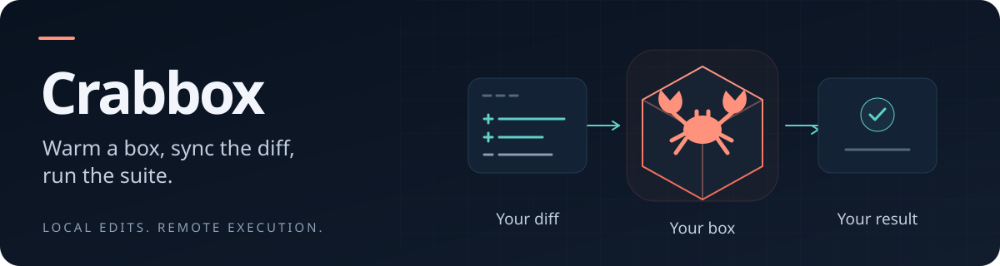

<picture>
  <source media="(max-width: 600px)" srcset="docs/assets/readme-hero-mobile.svg">
  
</picture>

# On-demand computers for coding agents.

Crabbox gives agents and humans a computer to run tests, builds, and UI checks
while they keep editing locally. Choose a cloud box, a local VM or container,
or a machine you already own.

[](https://github.com/openclaw/crabbox/actions/workflows/ci.yml)
[](https://github.com/openclaw/crabbox/actions/workflows/release-assets.yml)
[](https://github.com/openclaw/crabbox/releases/latest)
[](LICENSE)

**[Quick start](#quick-start)** · [Commands](#everyday-commands) · [Any OS](#any-os) ·
[Desktop and browser](#desktop-browser-and-portals) · [Providers](#providers) ·
[Install](#install) · [Docs](https://crabbox.sh/)

With your provider and project dependencies configured:

```sh
crabbox run -- pnpm test
```

1. Lease a box and sync your working tree, including uncommitted changes.
2. Run `pnpm test` there and stream the output back to your terminal.
3. Return the command's exit code and release the one-shot box.

## Why Crabbox?

- **More agents, less contention.** Give concurrent work separate cloud boxes
  instead of making every test suite compete for your laptop's CPU, RAM, and ports.
- **A faster edit–test loop.** Keep prepared boxes warm, reuse installed
  dependencies, and sync changes without committing or pushing first.
- **Test across operating systems.** Target Linux, macOS, native Windows, or
  WSL2 from the same CLI. Choose the provider and image for the job.
- **See and drive the result.** Open a desktop with VNC or WebVNC, run a browser,
  edit through browser VS Code, and inspect runs in the coordinator portal.
- **Share capacity with a team.** The optional coordinator keeps cloud credentials
  centrally, tracks usage, enforces spend caps, and expires stale leases.

Capabilities vary by provider. Crabbox supplies computers and execution evidence;
your agent or harness decides what to run and what the result means.

## Quick start

### 1. Try a local box

[Install Crabbox](#install), start Docker or Podman, and enter a **Git repository
you trust**. No cloud account or coordinator login is needed:

```sh
crabbox doctor --provider local-container
crabbox run --provider local-container -- uname -a
```

You should see Linux kernel information, followed by cleanup of the one-shot
container. First startup includes an image pull and bootstrap. The default box
has Crabbox's sync/run prerequisites; supply your project's runtime and dependencies.

### 2. Run a project's tests

For a Node.js repository with a `package-lock.json` and an `npm test` script:

```sh
crabbox run --provider local-container \
  --local-container-image node:22-bookworm \
  --shell 'npm ci && npm test'
```

Choose an image compatible with your project. For remote boxes, use a prepared
image, repository setup scripts, or [Actions hydration](docs/features/actions-hydration.md).
Dependency and build directories are excluded from normal [workspace sync](docs/features/sync.md).

### 3. Reuse a box while you iterate

```sh
crabbox warmup --provider local-container --slug dev-box
crabbox run --provider local-container --id dev-box -- uname -a
# Edit locally, then run again with the same --id.
crabbox connect --provider local-container --id dev-box
crabbox stop --provider local-container dev-box
```

Replace `uname -a` with your test command once the box is prepared. `warmup`
keeps a reusable lease; `prewarm` also performs Actions hydration. Use the
printed `cbx_...` ID or friendly slug to select it. Each agent can keep its own
lease and working directory.

### Already have a team coordinator?

Use your team's URL in place of this example:

```sh
crabbox login --url https://broker.example.com
crabbox doctor
crabbox run -- pnpm test
```

The repository must select a provider and prepare its remote runtime and
dependencies. For your own cloud account, follow a [provider guide](#providers)
and skip coordinator login. Cloud capacity is billed by the provider; choose
[machine sizes](#machine-classes) deliberately.

[Getting started](docs/getting-started.md) · [Local Container](docs/providers/local-container.md)

## Everyday commands

| Command | What it does |
| --- | --- |
| `crabbox doctor` | Check prerequisites, configuration, and provider reachability. |
| `crabbox providers --json` | Discover providers, targets, and capabilities. |
| `crabbox run -- <cmd>` | Lease, sync, run, stream output, and release. |
| `crabbox run --shell '<script>'` | Run a multi-step shell command. |
| `crabbox warmup` / `crabbox prewarm` | Keep a box ready; `prewarm` also hydrates from Actions. |
| `crabbox run --id <box> -- <cmd>` | Sync changes and run on an existing box. |
| `crabbox connect --id <box>` | Open an interactive shell. |
| `crabbox ssh --id <box>` | Print the SSH command for your own tools. |
| `crabbox job run <name>` | Run a named workflow from repository configuration. |
| `crabbox list` / `crabbox stop <box>` | List active boxes or release one. |

Use `--script <file>` for longer scripts. Commands use your configured provider;
pass `--provider <name>` to select one explicitly. See [Commands](docs/commands/README.md)
and the [CLI reference](docs/cli.md) for details.

## Any OS

Run platform-specific tests without moving your local checkout. These are
execution targets, not just operating systems that can install the CLI:

| Target | Providers |
| --- | --- |
| Linux | Cloud VMs, local containers, self-hosted VMs, and delegated sandboxes; see the [complete list](#providers). |
| macOS | [anthropic-sandbox-runtime](docs/providers/anthropic-sandbox-runtime.md), [aws](docs/providers/aws.md), [external](docs/providers/external.md), [lume](docs/providers/lume.md), [parallels](docs/providers/parallels.md), [ssh](docs/providers/ssh.md), [tart](docs/providers/tart.md). |
| Native Windows | [aws](docs/providers/aws.md), [azure](docs/providers/azure.md), [external](docs/providers/external.md), [hyperv](docs/providers/hyperv.md), [mxc](docs/providers/mxc.md), [parallels](docs/providers/parallels.md), [ssh](docs/providers/ssh.md), [windows-sandbox](docs/providers/windows-sandbox.md). |
| WSL2 | [aws](docs/providers/aws.md), [azure](docs/providers/azure.md), [external](docs/providers/external.md), [parallels](docs/providers/parallels.md), [ssh](docs/providers/ssh.md). |

The catalog reports supported targets; you still need the provider's credentials,
hosts, images, and guest setup. For example, macOS VMs need prepared Mac hosts or
images, and AWS macOS uses Dedicated Hosts. WSL2 is a Linux execution environment
inside Windows; desktop/VNC needs native Windows mode instead.
The catalog also lists [CUA](docs/providers/cua.md) for Linux, macOS, and Windows,
but its Crabbox adapter currently supports inspection only.

```sh
crabbox providers --target macos
crabbox providers --target windows/normal
crabbox providers --target windows/wsl2
```

Select the OS with `--target linux|macos|windows` and Windows execution with
`--windows-mode normal|wsl2`. See the [provider matrix](docs/providers/README.md)
for the exact target and capability combinations.

## Desktop, browser and portals

Keep a visible session when a test needs a browser, a desktop, or a human handoff.
For a configured coordinator-backed Linux provider with these capabilities
(such as AWS, Azure, or Hetzner):

```sh
crabbox warmup --class tiny --desktop --browser --code --slug ui-box
crabbox webvnc --id ui-box --open --take-control
```

Keep the WebVNC process running while viewing. From another terminal, you can
open the browser editor or capture the desktop:

```sh
crabbox code --id ui-box --open
crabbox screenshot --id ui-box --output desktop.png
# Release the lease when finished.
crabbox stop ui-box
```

| Surface | What you can do |
| --- | --- |
| [Native VNC](docs/commands/vnc.md) | `crabbox vnc --id <box> --open` tunnels to the desktop through SSH. Managed VNC stays on the runner's loopback interface. |
| [WebVNC](docs/commands/webvnc.md) | View a desktop in the browser, observe a shared session, or take control. Coordinator sessions use an authenticated portal; direct providers can use a local viewer or a registered portal bridge. |
| [Browser capability](docs/features/capabilities.md#browser) | Request `--browser` for an installed browser and `BROWSER` / `CHROME_BIN` environment variables. Add `--desktop` for a visible session. Browser login state is yours to manage. |
| [Desktop automation](docs/commands/desktop.md) | Launch apps, take screenshots, click, type, or record on supported targets. Input and recording support varies by OS and desktop environment. |
| [Browser VS Code](docs/commands/code.md) | `crabbox code` opens code-server on a Linux lease created with `--code`. It requires coordinator login, an isolated Code origin configured by the operator, and a running local bridge. |
| [Coordinator portal](docs/features/portal.md) | Open `/portal` on your coordinator to inspect leases, run history, logs, events, and live WebVNC/Code views. Share access and hand desktop control between authorized viewers. |

Desktop support includes managed Linux, AWS/Azure native Windows, EC2 Mac,
prepared Tart/Parallels Macs, compatible External adapters, and local containers;
static SSH desktops are explicitly host-managed. Check the
[desktop support guide](docs/features/interactive-desktop-vnc.md) before choosing a target.

Kept registered desktop leases can start the bridge automatically with
`broker.autoWebVNC: true`. Registration adds portal access while the direct
provider retains lifecycle ownership. [Tailscale](docs/features/tailscale.md)
can supply the SSH network path; it does not expose VNC publicly.
Provider `url-bridge` capabilities are separate app-preview routes, not desktop
access; discover them with `crabbox providers --feature url-bridge`.

## Providers

**80 built-in providers plus the `external` plugin contract: 81 catalog entries.**
The groups below follow the compiled catalog and link to each provider's setup
and limitations. Some adapters delegate execution; service-control adapters do
not run arbitrary commands. SSH, desktops, snapshots, and cleanup are not uniform.

<!-- BEGIN README PROVIDER LIST -->

### Brokerable clouds

Catalog category: `brokerable-cloud`. Run directly or let the coordinator own
credentials, shared capacity, spend caps, and expiry.

| Provider | Best fit |
| --- | --- |
| [aws](docs/providers/aws.md) | Broad Linux, Windows, WSL2, and macOS cloud coverage. |
| [azure](docs/providers/azure.md) | Linux or Windows workloads in Azure. |
| [gcp](docs/providers/gcp.md) | Linux compute with broad machine selection. |
| [hetzner](docs/providers/hetzner.md) | Cost-effective high-CPU Linux VM. |

### Direct clouds and development boxes

Catalog category: `direct-cloud`. Daytona also supports coordinator-backed SSH.

| Provider | Best fit |
| --- | --- |
| [ascii-box](docs/providers/ascii-box.md) | Managed Linux boxes over SSH through Boat (formerly ASCII Box). |
| [boxd](docs/providers/boxd.md) | Experimental Linux microVM leases; port 8000 is publicly proxied without authentication. |
| [coder](docs/providers/coder.md) | Coder-backed Linux workspace over SSH proxy. |
| [daytona](docs/providers/daytona.md) | Managed development sandbox with direct toolbox execution or brokered SSH. |
| [digitalocean](docs/providers/digitalocean.md) | Simple direct Linux VM. |
| [exe-dev](docs/providers/exe-dev.md) | Fast managed Linux VM exposed over SSH. |
| [github-codespaces](docs/providers/github-codespaces.md) | Repository-backed Linux devcontainer over SSH. |
| [hostinger](docs/providers/hostinger.md) | Linux VPS subscriptions; releasing a lease does not cancel billing. |
| [linode](docs/providers/linode.md) | Straightforward direct Linux VM. |
| [machine0](docs/providers/machine0.md) | Persistent Linux VMs with live CPU/GPU sizing; stopping still incurs compute cost. |
| [morph](docs/providers/morph.md) | Managed Linux VMs over SSH; release pauses by default rather than deleting. |
| [namespace-devbox](docs/providers/namespace-devbox.md) | Fast managed development box over SSH. |
| [namespace-instance](docs/providers/namespace-instance.md) | Short-lived managed Linux compute over SSH. |
| [nebius](docs/providers/nebius.md) | Direct Linux VM lease with optional GPU selection. |
| [ovh](docs/providers/ovh.md) | OVHcloud Public Cloud Linux VM. |
| [phala](docs/providers/phala.md) | Confidential Linux compute over SSH with TDX attestation enabled by default. |
| [scaleway](docs/providers/scaleway.md) | Direct Linux VM on Scaleway Instances. |
| [sealos-devbox](docs/providers/sealos-devbox.md) | Sealos DevBox Linux workspace over SSHGate or NodePort. |
| [sprites](docs/providers/sprites.md) | Fast Linux microVM over provider SSH proxy. |
| [tencentcloud](docs/providers/tencentcloud.md) | Linux SSH leases on Tencent Cloud CVM. |
| [tenki](docs/providers/tenki.md) | Managed Linux sandboxes through Tenki's SSH gateway and certificates. |
| [vultr](docs/providers/vultr.md) | Direct Linux VM on Vultr. |

### Delegated sandboxes

Catalog category: `delegated-sandbox`.

| Provider | Best fit |
| --- | --- |
| [agent-sandbox](docs/providers/agent-sandbox.md) | Delegated Linux execution from a Kubernetes Agent Sandbox warm pool. |
| [aws-lambda-microvm](docs/providers/aws-lambda-microvm.md) | Stateful ARM64 execution with a compatible Crabbox runner image. |
| [azure-dynamic-sessions](docs/providers/azure-dynamic-sessions.md) | Short delegated container sessions in Azure. |
| [blaxel](docs/providers/blaxel.md) | Managed delegated Linux sandbox execution. |
| [cloud-run-sandbox](docs/providers/cloud-run-sandbox.md) | Delegated Cloud Run execution through a sandbox launcher or gateway. |
| [cloudflare](docs/providers/cloudflare.md) | Fast delegated Linux container execution. |
| [cloudflare-dynamic-workers](docs/providers/cloudflare-dynamic-workers.md) | Hosted Worker modules; no shell or filesystem sync. |
| [cloudflare-sandbox](docs/providers/cloudflare-sandbox.md) | Cloudflare Sandbox Linux command execution through a bridge. |
| [codesandbox](docs/providers/codesandbox.md) | Managed Linux development environments through a local Node SDK bridge. |
| [crownest](docs/providers/crownest.md) | Hosted Workspace Runs with archive sync and durable evidence; no downloads yet. |
| [cubesandbox](docs/providers/cubesandbox.md) | Self-hosted E2B-compatible MicroVM command execution. |
| [e2b](docs/providers/e2b.md) | Hosted ephemeral code sandbox. |
| [freestyle](docs/providers/freestyle.md) | Hosted delegated Linux VM execution. |
| [islo](docs/providers/islo.md) | Hosted execution with keep/pause and a provider-owned SSH helper. |
| [modal](docs/providers/modal.md) | Hosted Python or GPU-oriented delegated workloads. |
| [nomad](docs/providers/nomad.md) | Self-hosted delegated Linux execution on an existing Nomad cluster. |
| [opencomputer](docs/providers/opencomputer.md) | Hosted delegated Linux VM execution. |
| [opensandbox](docs/providers/opensandbox.md) | Hosted delegated sandbox through an open SDK. |
| [orgo](docs/providers/orgo.md) | Linux computer execution through HTTP; no Crabbox workspace sync. |
| [smolvm](docs/providers/smolvm.md) | Lightweight hosted microVM execution. |
| [superserve](docs/providers/superserve.md) | Hosted delegated Linux sandbox. |
| [tensorlake](docs/providers/tensorlake.md) | Hosted Firecracker-backed delegated execution. |
| [upstash-box](docs/providers/upstash-box.md) | Hosted short-lived delegated sandbox. |
| [vercel-sandbox](docs/providers/vercel-sandbox.md) | Hosted delegated Linux microVM execution. |

### Local virtual machines

Catalog category: `local-vm`.

| Provider | Best fit |
| --- | --- |
| [apple-machine](docs/providers/apple-machine.md) | Local delegated Linux machine execution. |
| [apple-vm](docs/providers/apple-vm.md) | Headless Linux ARM64 VM on Apple silicon. |
| [hyperv](docs/providers/hyperv.md) | Native Windows VMs on a Windows host with Hyper-V. |
| [lume](docs/providers/lume.md) | Layered macOS development VMs from a prepared Apple silicon base. |
| [multipass](docs/providers/multipass.md) | Portable local Ubuntu VM. |
| [parallels](docs/providers/parallels.md) | macOS, Linux, or Windows VM clones and snapshots from prepared sources. |
| [tart](docs/providers/tart.md) | macOS VM testing on Apple silicon with prepared Tart images. |

### Self-hosted virtualization

Catalog category: `self-hosted-virtualization`.

| Provider | Best fit |
| --- | --- |
| [firecracker](docs/providers/firecracker.md) | Linux microVMs on your own KVM host with prepared guest and network assets. |
| [incus](docs/providers/incus.md) | Self-hosted Linux containers or VMs. |
| [kubevirt](docs/providers/kubevirt.md) | Kubernetes-hosted Linux VM. |
| [proxmox](docs/providers/proxmox.md) | Self-hosted Linux VM fleet. |
| [xcp-ng](docs/providers/xcp-ng.md) | Self-hosted Linux VM pool over XAPI. |

### GPU clouds

Catalog category: `gpu-cloud`.

| Provider | Best fit |
| --- | --- |
| [lambda](docs/providers/lambda.md) | Direct GPU-backed Linux workload over SSH. |
| [nvidia-brev](docs/providers/nvidia-brev.md) | Managed NVIDIA GPU workspace over SSH. |
| [runpod](docs/providers/runpod.md) | GPU-backed Linux workload over public SSH. |
| [vast](docs/providers/vast.md) | Direct Linux GPU lease from the Vast.ai offer market. |
| [wandb](docs/providers/wandb.md) | Delegated ML or GPU run environment. |

### Local sandboxes

Catalog category: `local-sandbox`.

| Provider | Best fit |
| --- | --- |
| [anthropic-sandbox-runtime](docs/providers/anthropic-sandbox-runtime.md) | Policy-constrained commands on the current Linux or macOS host; no remote lease. |
| [docker-sandbox](docs/providers/docker-sandbox.md) | Local delegated sessions through the standalone `sbx` CLI. |
| [mxc](docs/providers/mxc.md) | Local isolated Windows command execution. |
| [windows-sandbox](docs/providers/windows-sandbox.md) | Disposable native Windows commands using Windows Sandbox on a Windows host. |

### Local container runtimes

Catalog category: `local-runtime`.

| Provider | Best fit |
| --- | --- |
| [apple-container](docs/providers/apple-container.md) | Local Linux containers on Apple silicon. |
| [local-container](docs/providers/local-container.md) | Local Linux tests through Docker or Podman; no cloud account needed. |

### CI proof runners

Catalog category: `ci-proof-runner`.

| Provider | Best fit |
| --- | --- |
| [blacksmith-testbox](docs/providers/blacksmith-testbox.md) | CI reproduction with proof and reusable sessions. |
| [semaphore](docs/providers/semaphore.md) | SSH debugging with the same image and secrets available to the CI job. |

### Bring your own SSH host

Catalog category: `byo-ssh`.

| Provider | Best fit |
| --- | --- |
| [ssh](docs/providers/ssh.md) | Your existing Linux, macOS, or Windows host; Crabbox never deletes the machine. |

### Service control

Catalog category: `service-control`.

| Provider | Best fit |
| --- | --- |
| [cua](docs/providers/cua.md) | Experimental read-only diagnostics and existing-sandbox inspection. |
| [fastapi-cloud](docs/providers/fastapi-cloud.md) | Inspect FastAPI Cloud deployment readiness; no arbitrary commands or app stops. |
| [railway](docs/providers/railway.md) | Inspecting or stopping an existing Railway service. |
| [unikraft-cloud](docs/providers/unikraft-cloud.md) | Running a prebuilt OCI image as a cloud microVM service. |

### External plugins

Catalog category: `external-provider`.

| Provider | Best fit |
| --- | --- |
| [external](docs/providers/external.md) | Your own provider through an executable contract; the adapter owns its safety and lifecycle semantics. |

<!-- END README PROVIDER LIST -->

### Machine classes

Managed providers with class-based capacity default to `beast`. Start with a
smaller `--class`, such as `tiny`, when evaluating cloud capacity. `--class`
selects a tier; `--type` pins a provider-native size and disables class fallback.
See [Configuration](docs/features/configuration.md) and your provider's guide.

## How it works

```text
Local checkout → Lease a box → Sync changes → Run → Stream output + exit code
                                   ↑                         |
                                   └── Reuse a warm box ──────┘
                                             or release it
```

The CLI sends your working tree, including nonignored uncommitted files. SSH
providers use direct CLI-to-runner connections; delegated providers own their
execution transport. One-shot runs release their leases; `warmup` and runs with
`--id` support reuse. Explicitly stop retained boxes when finished.

The optional coordinator manages shared leases, credentials, budgets, expiry,
and history. Provider adapters own provisioning and cleanup. Existing SSH hosts
remain yours: Crabbox neither provisions nor deletes them.

### Coordinator deployment choices

Use providers directly, deploy the coordinator on Cloudflare Workers with a
Durable Object, or self-host it on Node.js with PostgreSQL. State does not
migrate automatically between runtimes. Follow the deployment and proof
requirements in [Infrastructure](docs/infrastructure.md).

[How Crabbox works](docs/how-it-works.md) · [Architecture](docs/architecture.md) · [Vision](VISION.md)

## When a run fails

| Situation | Next step |
| --- | --- |
| The box is unreachable | Run `crabbox doctor --provider <name>`. |
| You need the failed environment | Add `--keep-on-failure`, then use `crabbox connect --id <box>`. |
| You need a fresh workspace sync | Add `--full-resync` to reset the remote workdir before syncing. |
| You need the command's output files | Use `--download remote=local`, repeatable for several files. |
| Output needs to go straight to a file | Use `--capture-stdout <path>` and `--capture-stderr <path>`. |

Failed SSH-backed and Blacksmith delegated runs save local failure bundles by
default. Follow the printed `failure-bundle local=…` path and review the contents
before sharing. See [Troubleshooting](docs/troubleshooting.md) and
[Observability](docs/observability.md).

## Highlights

[Named jobs](docs/features/jobs.md) keep repeatable setup and test commands in the
repository. [Checkpoints](docs/features/checkpoints.md) save, restore, or fork
workspace state. [Failure capsules](docs/features/capsules.md) replay failing CI
runs. [Artifacts](docs/features/artifacts.md), [test results](docs/features/test-results.md),
and [telemetry](docs/features/telemetry.md) make runs inspectable.
[Pond peer groups](docs/features/pond.md) connect related leases for multi-machine tests.

## Configuration

```sh
crabbox init --detect
crabbox config show
```

Review the generated configuration and setup before running it. Settings resolve
from flags, environment, repository configuration, user configuration, then defaults.
A repository's `.crabbox.yaml` can select its provider and image:

```yaml
provider: local-container
localContainer:
  image: node:22-bookworm
lease:
  idleTimeout: 30m
```

Your shell environment is not forwarded wholesale. Only `CI` and `NODE_OPTIONS`
are allowed by default; configure `env.allow` or pass `--allow-env NAME` for
additional variables. Keep provider credentials outside the repository and out
of command-line arguments.

[Configuration](docs/features/configuration.md) · [Environment forwarding](docs/features/env-forwarding.md) · [Sync](docs/features/sync.md)

## Integrations

`crabbox init --detect` also generates a repository-local Agent Skill for
compatible coding agents. To install the published skills separately:

```sh
npx skills add openclaw/crabbox --skill crabbox
npx skills add openclaw/crabbox --skill crabbox-quickstart
```

Use `crabbox-quickstart` for the first Docker/Podman run and `crabbox` for remote
execution and repository workflows. **Install the CLI separately.**
[Zed](integrations/zed/README.md) and [Herdr](plugins/herdr/README.md) integrations
add editor and lease controls. See the [agent guide](docs/integrations/agents.md)
and [integration catalog](docs/integrations/README.md).

## Who Crabbox is for

Coding agents running tests in parallel, maintainers with expensive builds,
contributors testing another OS, and teams sharing remote capacity. Use Crabbox
alongside CI for an interactive edit–run loop and reviewable execution evidence.

## Trust model

Run **trusted repositories**. Crabbox trusts the local OS user, repository
configuration, project tooling, and authenticated coordinator operators.
Configuration can execute helpers, mount host resources, and control infrastructure;
container socket passthrough grants access to the host engine.

The coordinator holds cloud credentials for brokered leases. Reuse and destructive
operations require verified ownership bound to the exact provider, resource, and
claim; names or labels alone are not proof. Ownership and inventory failures
must fail closed. See [Vision](VISION.md) for the lifecycle contract.

Coordinator access controls serve cooperative teams, not mutually hostile tenants.
Captured output, artifacts, and failure bundles are not scrubbed of secrets;
review them before sharing. Read the [Security Policy](SECURITY.md) and
[Operational security](docs/security.md).

## Install

Homebrew installs the complete release distribution:

```sh
brew install openclaw/tap/crabbox
crabbox --version
```

For macOS, Linux, and Windows, you can also download a
[release archive](https://github.com/openclaw/crabbox/releases/latest).
See the [Windows installation guide](docs/windows-install.md) for Windows setup.
SSH workflows need `git`, `ssh`, `ssh-keygen`, `rsync`, and `curl` locally;
the local-container quick start also needs Docker or Podman.

<details>
<summary>Runtime packs and CLI-only Go installs</summary>

Keep a release's `crabbox-runtime/` directory beside its real CLI executable.
Filesystem-capable packs contain amd64 and arm64 companions for Linux, macOS,
and Windows; Linux companions also provide native managed execution for Linux
and WSL2. Do not mix builds or copy only the CLI. Reinstall the matching archive
or Homebrew package if an official release's pack is missing or incomplete;
release installations do not compile replacement companions from source.

For a CLI-only source install, pin a supported release (v0.44.0 or later):

```sh
go install github.com/openclaw/crabbox/cmd/crabbox@v0.70.0
```

The module requires Go 1.26 and prefers go1.26.5. Use Go 1.26.5 or newer, or
leave automatic toolchain selection enabled. Avoid `@latest` while older,
incompatible release tags remain visible.

`go install` omits companion executables and assets, including the Apple VM
helper and native runtime pack. It is not the signed/notarized release
distribution. Source-built CLIs retain the shell-backed supervisor route and
can compile the dependency-free filesystem helper with a local Go 1.26+ compiler;
that does not build the managed-command supervisor. Use Homebrew or a complete
release archive for full platform capabilities, especially Apple VM support.

</details>

## Docs

**[Documentation site](https://crabbox.sh/)** · [Documentation index](docs/README.md) · [Changelog](CHANGELOG.md)

| I want to… | Start here |
| --- | --- |
| Set up a repository | [Getting started](docs/getting-started.md) · [Configuration](docs/features/configuration.md) |
| Look up a command or feature | [Commands](docs/commands/README.md) · [Features](docs/features/README.md) · [CLI](docs/cli.md) |
| Understand the design | [Concepts](docs/concepts.md) · [Architecture](docs/architecture.md) · [Source map](docs/source-map.md) |
| Operate shared infrastructure | [Infrastructure](docs/infrastructure.md) · [Operations](docs/operations.md) · [Observability](docs/observability.md) |
| Debug a run | [Troubleshooting](docs/troubleshooting.md) · [History and logs](docs/features/history-logs.md) · [Performance](docs/performance.md) |
| Extend Crabbox | [Provider authoring](docs/features/provider-authoring.md) · [External provider](docs/providers/external.md) · [Repository guidelines](AGENTS.md) |

## Development

Read [Repository guidelines](AGENTS.md) and the [Source map](docs/source-map.md).
Use the Go toolchain in `go.mod` and the Node version in `.node-version`.

```sh
go build -trimpath -o bin/crabbox ./cmd/crabbox
go vet ./...
go test -race -timeout=20m ./...

npm ci --prefix worker
npm run format:check --prefix worker
npm run lint --prefix worker
npm run check --prefix worker
npm run check:node --prefix worker
npm test --prefix worker
npm run build --prefix worker
npm run build:node --prefix worker

scripts/check-docs.sh
```

CI also checks Go modules, coverage, repository scripts, generated files, and
release snapshots; [.github/workflows/ci.yml](.github/workflows/ci.yml) defines
the full gate. See [Documentation authoring](docs/README.md#about-these-docs)
for site conventions, [Infrastructure](docs/infrastructure.md) for deployments,
and [Release engineering](docs/RELEASING.md) for the release process.

## License

[MIT](LICENSE).
